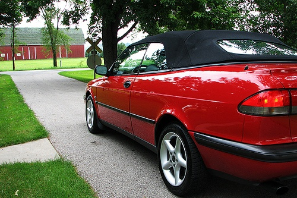

# super-res
An implementation of perpetual losses for super resolution (https://arxiv.org/pdf/1603.08155.pdf)

<figure>
  <figcaption>Low resolution starting image</figcaption>
  
</figure>

<figure>
  <figcaption>High resolution upsampled image</figcaption>
  
</figure>
