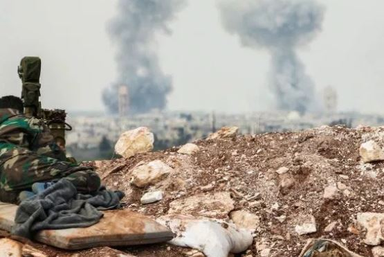

# Super Resolution
A simple extension of perpetual losses for super resolution (https://arxiv.org/pdf/1603.08155.pdf) to yield excellent results 
for image inpainting. 

# Usage for one image
> python test.py --input_image /path/to/img.jpg --model checkpoints/model_namel.pth --output_filename sample.jpg

# Results: Super-Resolution

<figure>
  <figcaption>Low resolution starting image</figcaption>
  
</figure>

<figure>
  <figcaption>High resolution upsampled image</figcaption>
  
</figure>

# Results: Inpainting

<figure>
  <figcaption>Before</figcaption>
  
</figure>

<figure>
  <figcaption>After</figcaption>
  
</figure>
